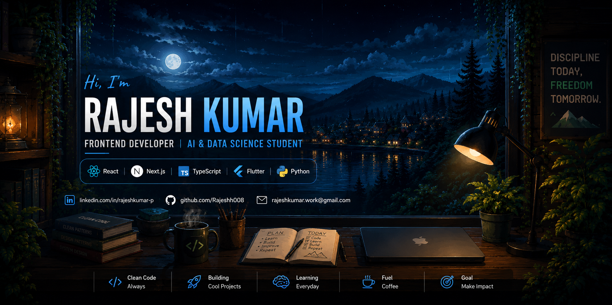

  

 
<h1 align="center">Hi 👋, I'm Rajesh Kumar</h1>

---

## 🚀 About Me

🎓 **B.Tech Artificial Intelligence & Data Science**

💻 Passionate about building modern, responsive, and user-friendly web applications.

🌱 **Currently Learning**
- React.js
- Next.js
- TypeScript
- GSAP Animations
- AI Integration

💡 **Interested In**
- Frontend Development
- Full Stack Development
- Artificial Intelligence
- UI/UX Design

---

## 🌐 Connect With Me

---

# 💻 Tech Stack

---

# 🚀 Featured Projects

### 🌟 Personal Portfolio
> Modern portfolio built with **Next.js + GSAP** animations.

---

### 🌟 Hiver AI Assignment
> AI-powered document processing application.

---

### 🌟 TuneFlow
> Flutter music player application.

---

### 🌟 Sleep Alarm App
> Smart Flutter mobile application.

---

### 🌟 ClauseWise
> AI-powered legal document analyzer.

---

# 📊 GitHub Analytics

---

# 🔥 GitHub Streak

---

# 🏆 GitHub Trophy

---

# 🛠 Tools

---

# 📈 Contribution Graph

---

# 👀 Visitors

---

# 📫 Contact

📩 **LinkedIn:**  
https://linkedin.com/in/rajesh-kumar-p-

⭐ *Thanks for visiting my profile! Feel free to connect and collaborate.*
